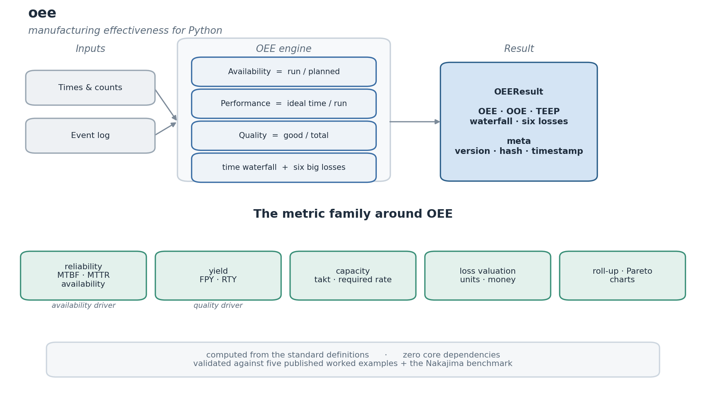
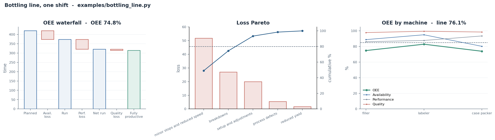

# oee

[](https://github.com/arikanatakan/oee/actions/workflows/ci.yml)
[](https://pypi.org/project/oee/)
[](LICENSE)

Overall Equipment Effectiveness for Python.

Compute OEE (Availability x Performance x Quality) from machine times and piece
counts, get the full time waterfall and the three loss categories, TEEP and
utilization, and roll figures up correctly across machines and shifts. Computed
from the standard definitions and validated against published worked examples.



## Motivation

OEE is the standard manufacturing efficiency metric, but Python has no library
for it: what exists is monitoring *applications* (Flask/Django dashboards) or
one-off tutorial scripts. The arithmetic looks trivial (three numbers
multiplied) and that is exactly why it is usually done wrong:

* the time waterfall (planned -> run -> net run -> fully productive) and where
  each loss sits is skipped;
* TEEP and utilization (which capture schedule loss) are left out;
* and figures are *averaged* across machines, which is incorrect: a fast machine
  and a slow one do not combine to the mean of their OEEs.

`oee` does these properly, from the standard definitions, and returns one result
with the factors, the waterfall, every loss, and provenance.

```
pip install oee
```

No runtime dependencies.

## Usage

The canonical worked example (Vorne's *Fast Guide to OEE*):

```python
import oee

r = oee.oee(
    planned_production_time=420,   # minutes (480 shift - 60 of breaks)
    downtime=47,
    ideal_rate=60,                 # pieces per minute
    total_count=19271,
    reject_count=423,
    all_time=480,                  # optional, for TEEP and utilization
)
r.availability   # 0.888
r.performance    # 0.861
r.quality        # 0.978
r.oee            # 0.748
r.teep           # 0.654
print(r.summary())
```

Roll up across machines (correctly, not by averaging):

```python
m1 = oee.oee(planned_production_time=100, run_time=90, ideal_cycle_time=1,
             total_count=80, good_count=80)     # OEE 0.80
m2 = oee.oee(planned_production_time=300, run_time=150, ideal_cycle_time=1,
             total_count=150, good_count=135)   # OEE 0.45

line = oee.aggregate([m1, m2])
line.oee         # 0.5375, not the 0.625 average of the two
```

Break the losses down into the six big losses:

```python
r = oee.oee(
    planned_production_time=480, downtime=80, ideal_cycle_time=0.5,
    total_count=700, reject_count=100,
    setup_time=30,        # of the 80 min down, 30 was setup
    startup_rejects=40,   # of the 100 rejects, 40 were at startup
)
r.six_losses
# {'breakdowns': 50.0, 'setup_and_adjustments': 30.0,
#  'minor_stops_and_reduced_speed': 50.0,
#  'process_defects': 30.0, 'reduced_yield': 20.0}
```

Rank the losses (or any downtime-reason breakdown) with a Pareto:

```python
for e in oee.pareto(r.six_losses):
    print(f"{e.label:30} {e.value:5.0f}  {e.share:5.0%}  cum {e.cumulative:5.0%}")
# breakdowns                        50    28%  cum   28%
# minor_stops_and_reduced_speed     50    28%  cum   56%
# process_defects                   30    17%  cum   72%
# setup_and_adjustments             30    17%  cum   89%
# reduced_yield                     20    11%  cum  100%
```

Or compute it from an event log of production runs and downtime events:

```python
r = oee.from_log(
    planned_production_time=420,
    runs=[{"count": 19271, "good": 18848, "ideal_rate": 60}],
    downtime_events=[
        {"reason": "changeover", "duration": 30, "planned": True},
        {"reason": "jam",        "duration": 17},
    ],
)
r.oee                  # 0.748
r.downtime_reasons     # {'changeover': 30, 'jam': 17} - ready for pareto()
```

When you already have the three factors:

```python
oee.oee_from_factors(0.90, 0.95, 0.999).world_class   # True (OEE >= 85%)
```

Charts come with the optional `plot` extra (`pip install oee[plot]`):

```python
oee.waterfall(r)              # the OEE time waterfall
oee.losses_pareto(r)          # a Pareto of the six big losses
oee.trend(shifts, factors=True)   # OEE and the factors across a sequence
```

Each draws onto a matplotlib Axes and returns it (`ax.figure.savefig(...)` to
save); matplotlib stays an optional extra, so the core has no dependencies.

Every result carries the factors, the time waterfall, the losses, `world_class`
and `meets_target` flags, `summary()`, and a JSON-safe `to_dict()` with
provenance (version, input hash, timestamp).

## Worked example

[`examples/bottling_line.py`](examples/bottling_line.py) runs the whole toolkit
on one shift of a beverage bottling line: the OEE factors and time waterfall,
the effectiveness family (OEE/OOE/TEEP), the six big losses and their Pareto,
the same shift from an event log, reliability, a correct multi-machine roll-up,
rolled throughput yield, capacity, and loss valuation. The filler reproduces the
canonical Vorne figure (OEE 74.79%); the rest is illustrative of a real line.



```text
$ python examples/bottling_line.py
== 1. Filler OEE, the time waterfall and the effectiveness family ==
  availability 0.888  x  performance 0.861  x  quality 0.978  =  OEE 0.748
  OEE 74.8%  >=  OOE 69.8%  >=  TEEP 65.4%
...
== 4. Reliability of the filler (the availability driver) ==
  3 breakdowns over 373 min up: MTBF 124.3 min, MTTR 9.0 min, inherent availability 93.2%

== 5. Roll up the line, correctly (not by averaging the OEEs) ==
  filler         planned  420 min   OEE 0.748
  labeler        planned  240 min   OEE 0.829
  case packer    planned  480 min   OEE 0.739
  line OEE 0.761  (time-weighted)   vs the misleading simple average 0.772

== 6. Rolled throughput yield across the three stations (quality) ==
  rolled throughput yield 95.874%  (lower than any one station)
...
== 8. The money behind the filler's losses ==
  lost good bottles this shift: availability 2820, performance 3109, quality 423  -> total 6352
  at $0.50/bottle that is $3,176 of lost contribution in one shift
```

## What it computes

| Group | Output |
|-------|--------|
| Factors | availability, performance, quality, OEE |
| Extended | TEEP, utilization (when total calendar time is given) |
| Waterfall | planned -> run -> net run -> fully productive time, with schedule, availability, performance and quality losses |
| Six big losses | breakdowns, setup and adjustments, minor stops and reduced speed, process defects, reduced yield |
| Pareto | rank any loss breakdown by share and cumulative share |
| Roll-up | correct aggregation across machines, lines and shifts |
| Charts | waterfall, six-big-losses Pareto and trend (optional `plot` extra) |

All times must be in the same unit; `ideal_cycle_time` is that unit per piece
(or pass `ideal_rate` in pieces per that unit). Performance above 100% is capped
and flagged, since it means the ideal rate or counts are off.

## Beyond OEE

The same data supports the metrics that surround OEE, each in the same `Result`
style with provenance.

The effectiveness family. Pass the planned downtime and `oee()` adds OOE
(measured over operating time = planned production time + planned downtime), so
you get all three at once (TEEP <= OOE <= OEE):

```python
r = oee.oee(planned_production_time=420, downtime=47, ideal_rate=60,
            total_count=19271, reject_count=423, all_time=480, planned_downtime=33)
r.oee, r.ooe, r.teep        # OEE >= OOE >= TEEP
```

Reliability, the maintenance driver of the availability factor:

```python
oee.reliability(operating_time=1000, failures=5, total_repair_time=50)
# MTBF 200, MTTR 10, inherent availability 95.2%
```

Yield, the multi-step quality view that extends the single-step quality factor:

```python
oee.rolled_throughput_yield([0.99, 0.98, 0.97]).rty    # 0.941
```

Capacity, and the money behind the losses:

```python
oee.takt_time(available_time=480, demand=240)          # 2.0 per unit
oee.loss_value(r, value_per_unit=12.0)                 # losses as units and money
```

| Metric | What it adds |
|--------|--------------|
| `oee()` with `planned_downtime` | OOE alongside OEE and TEEP |
| `reliability()` | MTBF, MTTR, inherent availability |
| `first_pass_yield()`, `rolled_throughput_yield()` | multi-step quality |
| `takt_time()`, `capacity()` | the pace needed to meet demand |
| `loss_value()` | losses in lost units and money |

## Status

Version 0.2.0. Single-machine OEE, the time waterfall, TEEP/utilization and OOE,
correct roll-up across machines and shifts, and the surrounding metrics
(reliability, yield, capacity and loss valuation). The `OEEResult` contract is
append-only from here.

Out of scope: data collection / machine connectivity (that is the job of an
MES or an IoT dashboard); `oee` is the calculation layer they can build on.

## Related

[oee-mcp](https://github.com/arikanatakan/oee-mcp) exposes these calculations
and charts to AI agents over the Model Context Protocol.

## References

### Definitions

OEE follows the standard definitions: Availability x Performance x Quality, the
time waterfall, the six big losses, TEEP and the world-class benchmark.

- Nakajima, S. (1988). *Introduction to TPM*. Productivity Press. The origin of
  OEE and the world-class benchmark (availability >= 90%, performance >= 95%,
  quality >= 99.9%, OEE >= 85%).
- SEMI E79. The semiconductor industry standard for equipment efficiency and OEE.
- Vorne Industries, *The Fast Guide to OEE* ([oee.com](https://www.oee.com/calculating-oee/)).

### Worked examples

The validation suite checks the computation against published worked examples,
each cited in its case:

| Example | OEE | Source |
|---------|-----|--------|
| 8-hour shift (widgets) | 74.79% | Vorne, *The Fast Guide to OEE* ([oee.com](https://www.oee.com/calculating-oee/)) |
| CNC machining shift | 68.52% | [TeepTrak, *How to Calculate OEE*](https://teeptrak.com/en/how-to-calculate-oee-formula-worked-example/) |
| Shift, clean numbers | 72.4% | [ReliaMag, *How to Calculate OEE*](https://reliamag.com/guides/how-to-calculate-oee/) |
| Longer-horizon run | 70.6% | [ReliaMag, *How to Calculate OEE*](https://reliamag.com/guides/how-to-calculate-oee/) |
| Packaging line | 67.5% | [FIRGELLI Automations, OEE Calculator](https://www.firgelliauto.com/blogs/engineering-calculators/oee-overall-equipment-effectiveness-calculator) |
| World-class benchmark | 85.4% | Nakajima (1988), *Introduction to TPM* |

## License

MIT. Written and maintained by [Atakan Arikan](https://github.com/arikanatakan),
MSc Student at Tsinghua University and Politecnico di Milano.
